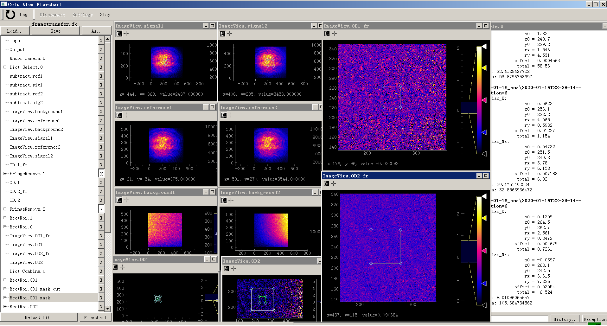
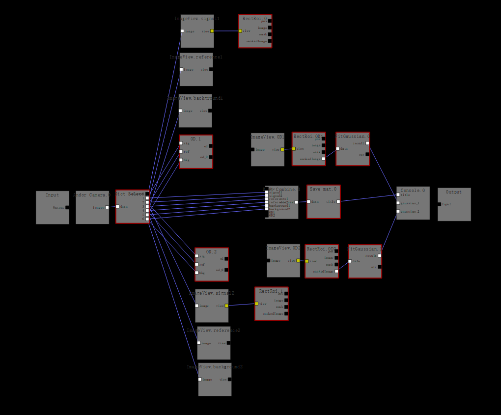

pycoldatom
==========

An image processing package mainly designed for cold atom experiments based on pyqtgraph.
Part of source files are modified from [Odysseus](https://github.com/edjoesu/odysseus)

This package is aimed at providing a flexible and universal framework for image acquiring and immediate analysis during the cold atom experiment, lighten the burden of operators from repetitive work of manipulating new data files. It is also easier and more robust to implement new features and integrate into the framework.

A flowchart GUI interface allows simple programming of the processing and visualization procedure without the knowledge of any language.

Features
--------

 * Control of Andor iXon Ultra 897, support temperature, EM and frame transfer
 * Generating file name automatically through communication with Cicero
 * Image view and set multiple region-of-interest
 * Basic math operations, like calculating optical depth of absorption imaging
 * Gaussian and boson bimodal fit
 * Fringe removal algorithm based on incremental singular value decomposition. See [arXiv:1007.2136](http://arxiv.org/abs/1007.2136)

 All features above have been tested in our lab.
